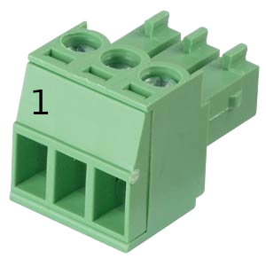

# Connectors

Please use these connectors for new hardware to have some kind of standard

## Power-Input

    Connector: CTB932HD-2
    Plug: CTB922HD-2
    Pinout: 
        1. GND
        2. 5/24V

## Digital-Input's

    Connector: CTB932HD-3
    Plug: CTB922HD-3
    Pinout: 
        1. 5/24V (selectable)
        2. Input
        3. GND

## Digital-Output's

    Connector: CTB932HD-3
    Plug: CTB922HD-3
    Pinout: 
        1. 5/24V (selectable)
        2. Output
        3. GND

## Stepper-Output's (4pin / Old)

    Connector: CTB932HD-4
    Plug: CTB922HD-4
    Pinout: 
        1. 5V
        2. Step
        3. Dir
        4. Enable

## Stepper-Output's (5pin / New)

    Connector: CTB932HD-4
    Plug: CTB922HD-4
    Pinout: 
        1. 5/24V (selectable)
        2. Step
        3. Dir
        4. Enable
        5. GND

## SPI (FPGA <-> Raspberry | FPGA <-> UDP-Bridge)

    Connector: 2.54 pinheader
    Pinout: 
        1. 5V
        2. MOSI
        3. MISO
        4. SCLK
        5. SEL
        6. GND

    FPGA is in slave mode

## PMOD (8IO's)
Pin | Pin | Pin | Pin
--- | --- | --- | ---
P1 | IO1 | IO5 | P7
P2 | IO2 | IO6 | P8
P3 | IO3 | IO7 | P9
P4 | IO4 | IO8 | P10
P5 | GND | GND | P11
P6 | 3V3 | 3V3 | P12

## Images

### CTB922HD-3

