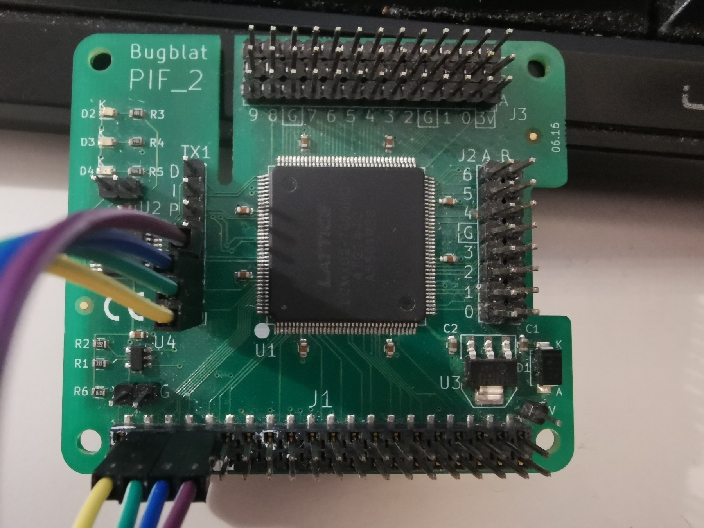

# Bugblat_PIF2


Unfortunately the flash tool no longer works on the Raspberry4,
at the moment I am using openFPGALoader as a workaround,
either from the PC with a UDB blaster or via bridges on the GPIO from the Raspberry


```
openFPGALoader -c libgpiod --pins=19:26:13:6 -r -f --unprotect-flash rio_build.bit
```


https://github.com/bugblat/pif2
https://bugblat.com/products/pif/



