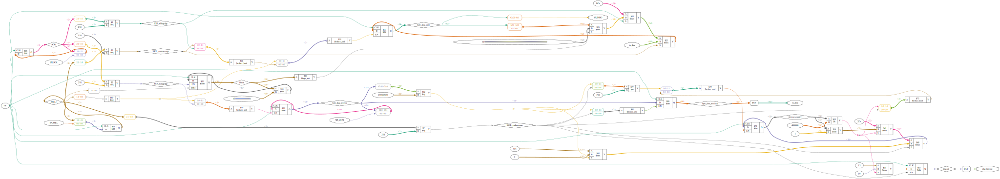

# Plugin: interface_spislave

communication interface ( RPI(Master) <-SPI-> FPGA(Slave) )

```
"interface": {
    "type": "spi",
    "pins": {
        "MOSI": "H13",
        "MISO": "G12",
        "SCK": "G13",
        "SEL": "G14"
    }
}
```

# interface_spislave.v


