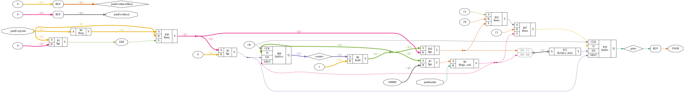

# Plugin: joint_pwmdir

PWM Joint Output with DIR-Pin

```
{
    "type": "pwmdir",
    "cl": false,
    "pins": {
        "pwm": "R14",
        "dir": "T14",
        "en": "D16"
    }
}
```

# joint_pwmdir.v



# Examples

## Mini Closed-Loop DC-Servo

### Video
[](https://www.youtube.com/shorts/0cOvUS33U_s "Mini Closed-Loop DC-Servo on LinuxCNC-RIO")


