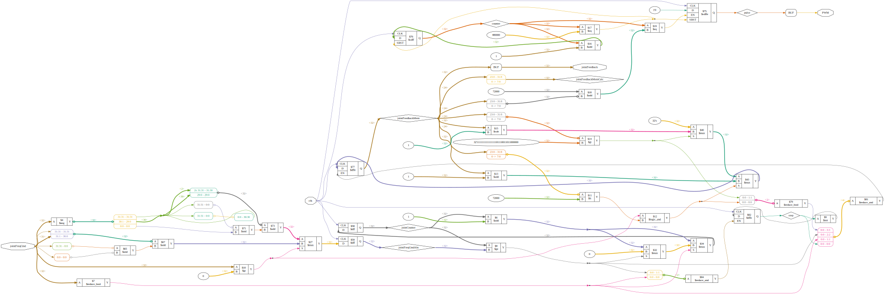

# Plugin: joint_rcservo

RCSERVO Joint Output

```
{
    "type": "rcservo",
    "cl": false,
    "pins": {
        "pwm": "C15",
        "dir": "C16",
        "en": "B16"
    }
},
```

# joint_rcservo.v


