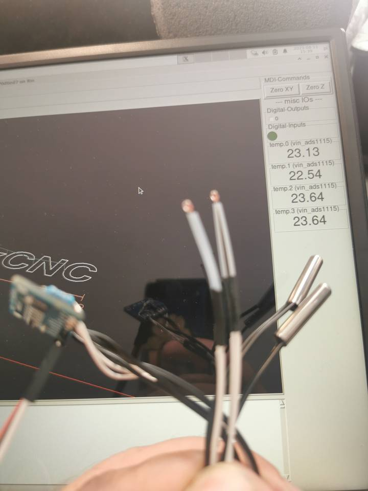

# Plugin: vin_ads1115

Analog-Input (4CH ADC)

```
{
    "type": "ads1115",
    "pins": {
        "sda": "D1",
        "scl": "D2"
    }
},
```

# vin_ads1115.v


# Examples

## 4 NTC temperature sensors



```
{
    "type": "vin_ads1115",
    "name": "temp",
    "sensors": ["NTC", "NTC", "NTC", "NTC"],
    "pins": {
        "sda": "20",
        "scl": "18"
    }
}
```

