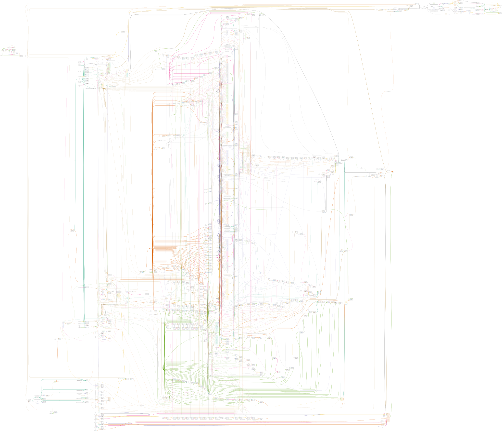

# Plugin: vin_ds18b20

Variable-Input for distance measurement via ultrasonic sonar sensor (HC-SR04)

```
        {
            "type": "ds18b20",
            "pins": {
                "onewire": "72"
            }
        }
```

# vin_ds18b20.v

