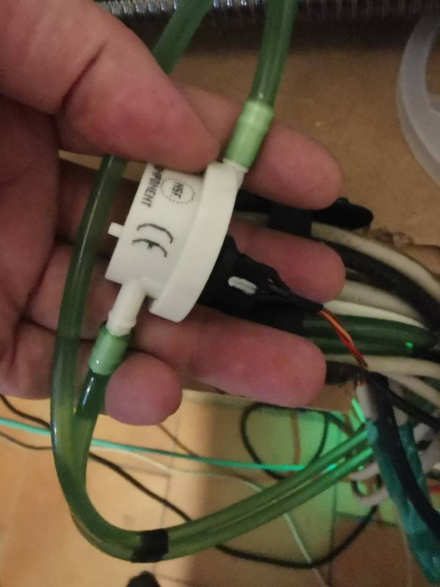
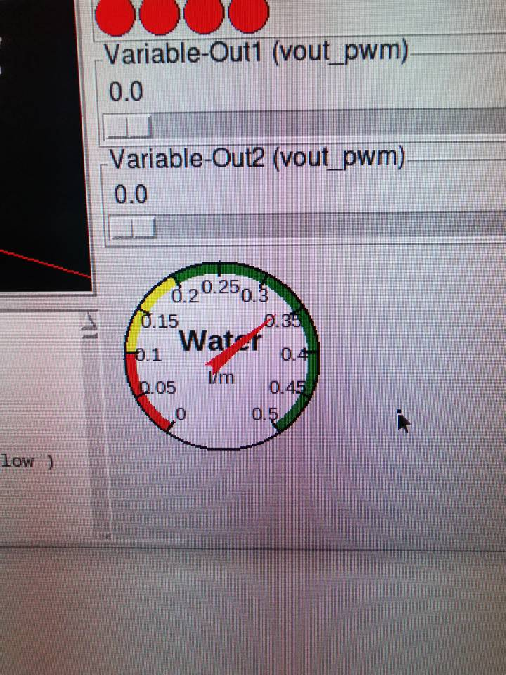

# Plugin: vin_frequency

Variable-Input for frequency measurement

the freq_min is used to set the value to 0 if no signal detected

```
{
    "type": "frequency",
    "freq_min": "10",
    "pin": "G5"
},
```

# vin_frequency.v


# Examples

## Water-Flow-Sensor




```
{
    "type": "vin_frequency",
    "name": "flow",
    "scale": 0.033,
    "display": {
        "type": "meter",
        "text": "Water",
        "subtext": "l/m",
        "min": 0,
        "max": 0.5,
        "region": [
            [0.2, 0.5, "green"],
            [0.1, 0.2, "yellow"],
            [0, 0.1, "red"]
        ]
    },
    "debounce": true,
    "pin": "33",
    "pullup": true,
    "freq_min": 2
},
```


