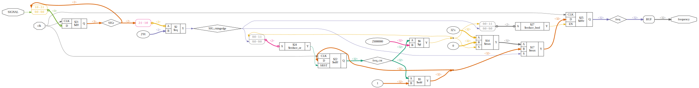

# Plugin: vin_frequency

Variable-Input for frequency measurement

the freq_min is used to set the value to 0 if no signal detected

```
{
    "type": "frequency",
    "freq_min": "10",
    "pin": "G5"
},
```

# Verilog-Flowchart


