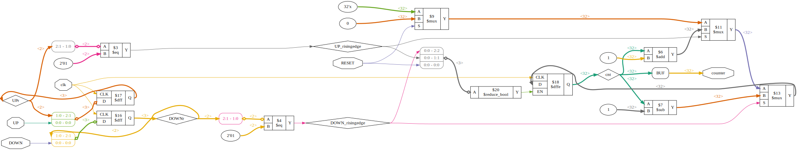

# Plugin: vin_pulsecounter

Variable-Input for pulse counting with up to 3 pins (all optional)

Up-Counter with reset:
```
{
    "type": "counter",
    "pin_up": "H5",
    "pin_reset": "J6"
},
```

Down-Counter with reset:
```
{
    "type": "counter",
    "pin_up": "H5",
    "pin_reset": "J6"
},
```

Up/Down-Counter:
```
{
    "type": "counter",
    "pin_up": "H5",
    "pin_down": "H6",
},
```

# vin_pulsecounter.v


