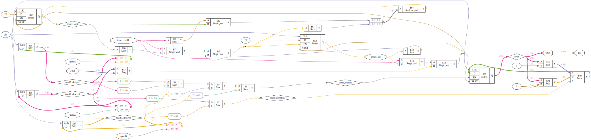

# Plugin: vin_quadencoder

Variable-Input for Quad-Encoder with Z-Pin (int32_t)

```
{
    "type": "quadencoderz",
    "pin_a": "C1",
    "pin_b": "D1"
    "pin_z": "E1"
},
```

# Verilog-Flowchart


