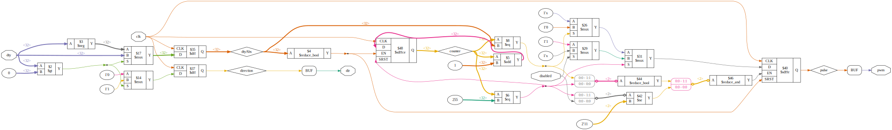

# Plugin: vout_pwm

Variable-Output for PWM-Signals with optional DIR pin


### LinuxCNC-RIO Laser on PWM-Output
[](https://www.youtube.com/shorts/ANdgskkGQqc "LinuxCNC-RIO Laser on PWM-Output")


## 100kHz PWM with DIR-Pin

```
{
    "type": "vout_pwm",
    "frequency": "100000",
    "pin": "T3",
    "dir": "R4"
},
```

##  extended setup:

for better generated sample config's

you can also connect the pin to a hal-net

```
{
    "type": "vout_pwm",
    "name": "spindle-speed",
    "net": "spindle.0.speed-out",
    "min": "0",
    "max": "10000",
    "invert_pwm": true,
    "pin": "76"
},
```

this will add the pin in the sample .hal to spindle.0.speed-out (Spindle-Speed-Control):

```
net spindle-speed <= spindle.0.speed-out
net spindle-speed => rio.SP.0
```

use min/max values to scale the speed (Spindle-RPM in linuxcnc 0-10000RPM) to the right pwm value (0-100%).

# vout_pwm.v


