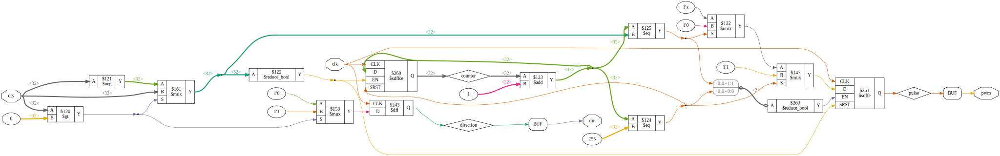

# Plugin: vout_sinepwm

Variable-Output for Sine-Waves via PWM-Signal

single Sine-Wave

```
{
    "type": "vout_sinepwm",
    "pin": "P5"
}
```

3-Phase Sine-Wave

```
{
    "type": "vout_sinepwm",
    "pins": ["P5", "N6", "N7"]
}
```

# vout_sinepwm.v


