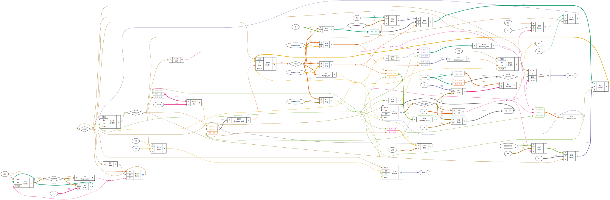

# Plugin: vout_udpoti

Variable-Output using digital poti with SPI Interface (like MCP413X/415X/423X/425X)

```
{
    "type": "spipoti",
    "bits": "8",
    "speed": "1000000",
    "pins": {
        "MOSI": "A1",
        "SCLK": "A3",
        "CS": "A4"
    }
},
```

https://cdn-reichelt.de/documents/datenblatt/A200/MCP4151_MIC.pdf

# Verilog-Flowchart


