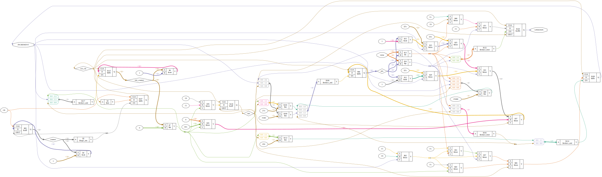

# Plugin: vout_udpoti

Variable-Output using digital poti with UpDown/Incr. Interface (like X9C104)

```
{
    "type": "udpoti",
    "resolution": "100",
    "speed": "100000",
    "pins": {
        "updown": "A1",
        "incr": "A2"
    }
},
```

but have a problem with my X9C104, it need only 31 steps for the full range,
don't know why :(

# vout_udpoti.v


